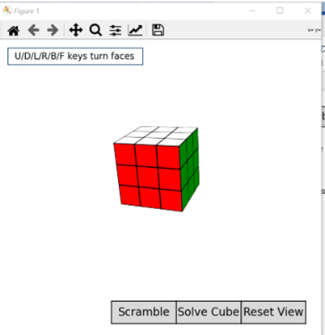
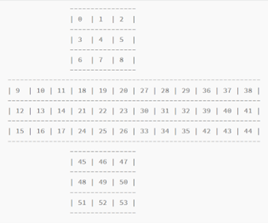
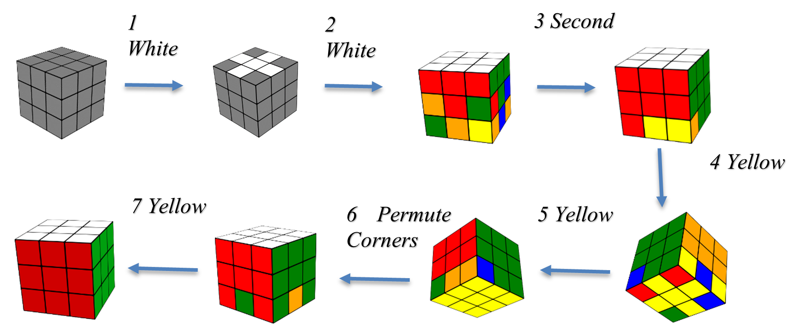

# RubikCube
The results of the Rubik's cube is showed as 



# Usage
## Cube
Mark Rubik's cube stickers with numbers:



## interactive
Using NumPy array to describe the cube
```` 
data.py
````

using project formulation to project the cube and display the cube base on  Matplotlib, and rotate the cube.

```` 
Projection.py
Rotate.py
````

using 7-steps algorithm to solve the cube from scrambled status.


```` 
solver.py
````
## Controls
* **Click and drag** used to change the viewing angle of the cube. Holding shift while clicking and dragging adjusts the line-of-sight rotation.
* **Scrambe/Solve/Reset buttons** used to scramble the cube to random status, recover the cube to original status, reset the cube to a certain direction.
* **F/D/B/U/L/R** keys used to rotate the cube in the direction of Front/Down/Back/Upper/Left/Right.
